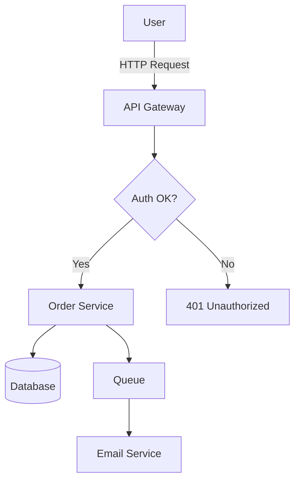
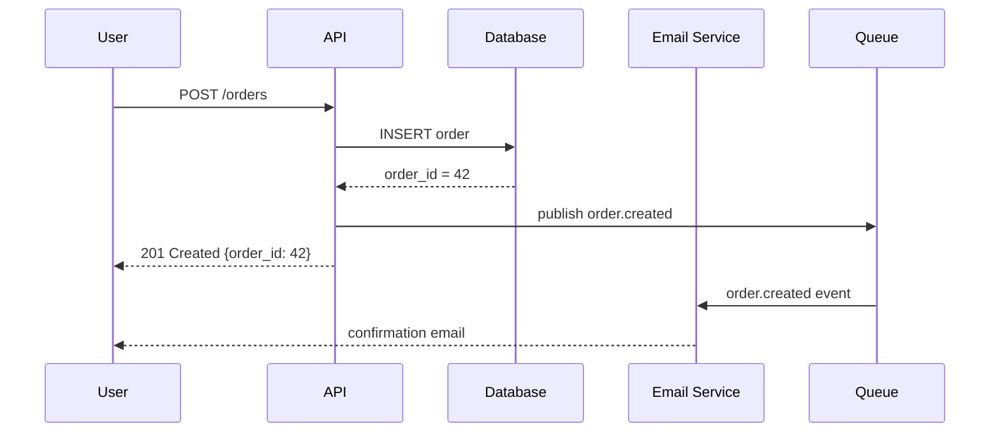
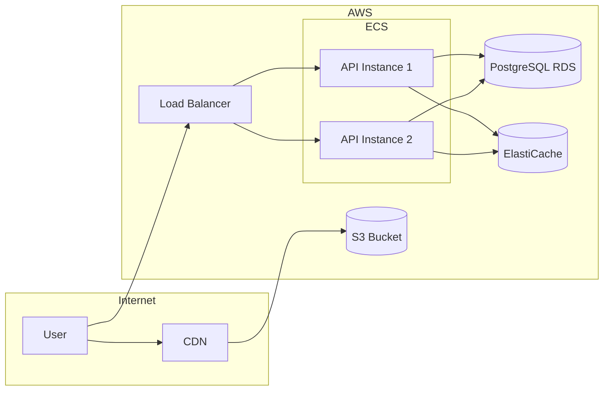
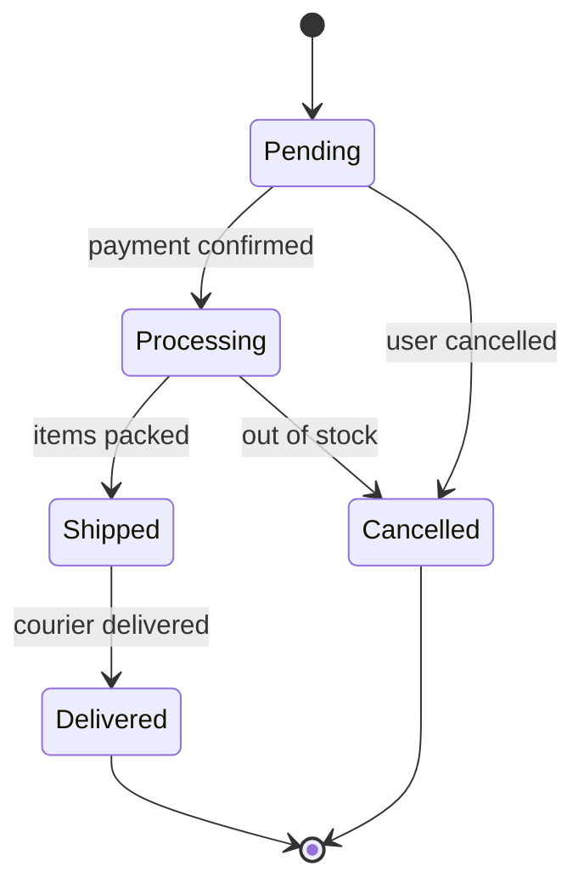
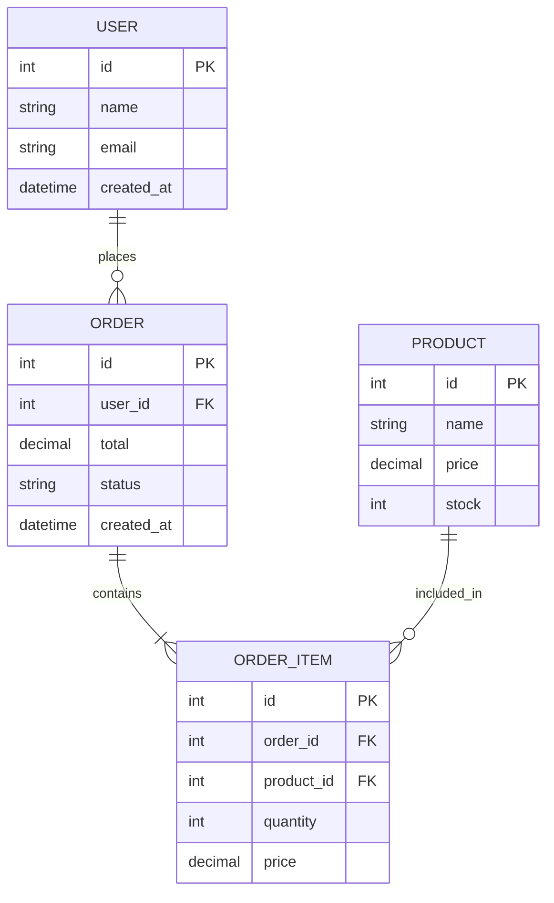

# Architecture Diagrams
*Visualizing software systems*

## Why Diagrams Matter
*A good diagram replaces 1000 words*

**Purpose** – Communicate architecture to team members, stakeholders, new developers  
**Rule** – A diagram should answer one specific question  
**Tools** – Mermaid (text-based), draw.io, Lucidchart, C4-PlantUML, Excalidraw

---

## C4 Model
*4 levels of zoom for architecture*

**C4** – Context, Containers, Components, Code  
**Key idea** – Each level zooms into more detail

### Level 1 – System Context
*Who uses the system and what external systems does it interact with*

```
┌──────────────────────────────────────────────┐
│                                              │
│  [User] ──────────────► [My App]             │
│                              │               │
│                         ┌────┘               │
│                         ▼                    │
│                    [Stripe API]               │
│                    [SendGrid]                 │
│                    [Google OAuth]             │
│                                              │
└──────────────────────────────────────────────┘
```

### Level 2 – Container
*Applications, databases, services that make up the system*

```
┌─────────────────────────────────────────────────────┐
│  My App                                             │
│                                                     │
│  [Browser] ──HTTPS──► [React SPA]                   │
│                              │                      │
│                         REST API                    │
│                              ▼                      │
│                       [FastAPI Backend]              │
│                        /           \                │
│                       ▼             ▼               │
│               [PostgreSQL]     [Redis Cache]         │
│                                     │               │
│                              [Celery Workers]        │
└─────────────────────────────────────────────────────┘
```

### Level 3 – Component
*Modules inside a container*

```
┌──────────────────────────────────────────────┐
│  FastAPI Backend                             │
│                                              │
│  ┌──────────┐  ┌──────────┐  ┌──────────┐   │
│  │  Auth    │  │  Orders  │  │ Products │   │
│  │ Router   │  │ Router   │  │  Router  │   │
│  └────┬─────┘  └────┬─────┘  └────┬─────┘   │
│       │              │              │        │
│  ┌────▼─────┐  ┌────▼─────┐  ┌────▼─────┐  │
│  │  Auth    │  │  Orders  │  │ Products │  │
│  │ Service  │  │ Service  │  │  Service │  │
│  └────┬─────┘  └────┬─────┘  └────┬─────┘  │
│       │              │              │       │
│  ┌────▼──────────────▼──────────────▼────┐  │
│  │           Repositories                │  │
│  └───────────────────────────────────────┘  │
└──────────────────────────────────────────────┘
```

---

## Mermaid Diagrams
*Text-based diagrams in Markdown*

### Flowchart



### Sequence Diagram



### Architecture Diagram



### State Diagram



### ER Diagram



---

## When to Use Each Diagram

| Diagram | Use for |
|---|---|
| C4 Context | Onboarding, stakeholder communication |
| C4 Container | Team architecture overview |
| C4 Component | Deep-dive into one service |
| Flowchart | Decision logic, process flows |
| Sequence | API interactions, event flows |
| State | Order/workflow lifecycle |
| ER Diagram | Database design |
| Architecture | Infrastructure overview |

---

## Best Practices

- One diagram = one question answered
- Include a title and brief description
- Keep it simple — remove anything that doesn't add clarity
- Version diagrams in git alongside code (use Mermaid or PlantUML)
- Update diagrams when architecture changes
- Use consistent shapes: rectangles = services, cylinders = databases, diamonds = decisions
