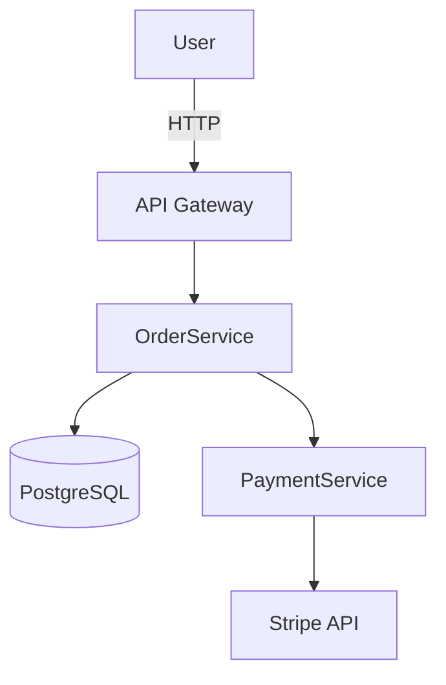
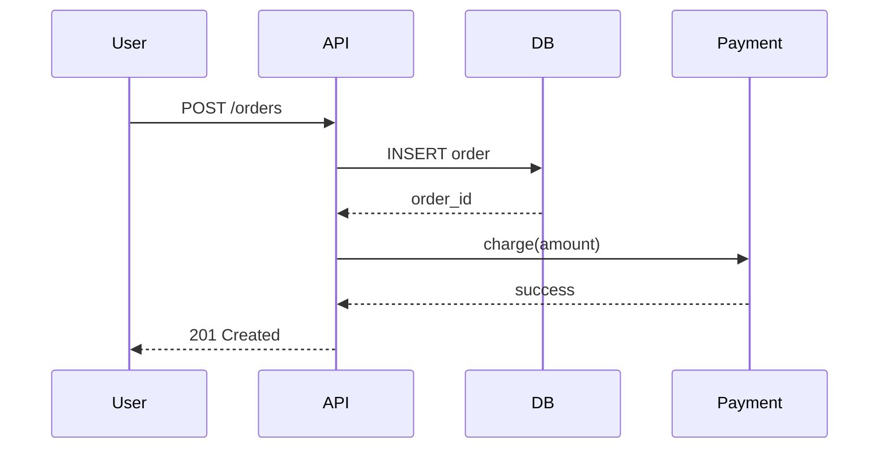

# Technical Documentation
*Writing docs that teams actually use*

## Types of Documentation
*Different docs serve different purposes*

**README** – Project overview, setup, usage (first thing anyone reads)  
**ADR** – Architecture Decision Record (why a decision was made)  
**API Docs** – How to use the API (OpenAPI/Swagger)  
**Runbook** – Step-by-step ops procedures (deploy, rollback, incident)  
**Wiki** – Team knowledge base

---

## README Profesional
*Structure of a great README*

```markdown
# Project Name
One-line description of what this does.

## Overview
2-3 sentences: what problem it solves, who it's for.

## Tech Stack
- Python 3.11, FastAPI, PostgreSQL, Docker, AWS

## Requirements
- Docker 24+
- Python 3.11+

## Quick Start
```bash
git clone https://github.com/user/project
cp .env.example .env
docker-compose up
```
App running at http://localhost:8000

## Environment Variables
| Variable | Description | Required |
|---|---|---|
| DATABASE_URL | PostgreSQL connection string | Yes |
| SECRET_KEY | JWT signing key | Yes |
| DEBUG | Enable debug mode | No (default: false) |

## API Documentation
Available at http://localhost:8000/docs (Swagger UI)

## Running Tests
```bash
pytest
pytest --cov=app
```

## Deployment
See [deployment guide](docs/deployment.md)

## Contributing
1. Fork the repo
2. Create a feature branch
3. Submit a pull request

## License
MIT
```

---

## ADR – Architecture Decision Record
*Document why a decision was made, not just what*

```markdown
# ADR-001: Use PostgreSQL instead of MongoDB

## Status
Accepted

## Date
2025-03-15

## Context
We need a database for storing user orders. Team debated
between PostgreSQL and MongoDB.

## Decision
Use PostgreSQL.

## Reasons
- Data is highly relational (users → orders → items)
- ACID transactions required for payment processing
- Team has more PostgreSQL experience
- Better fit for complex queries and reporting

## Consequences
- Need to define schema upfront
- Schema migrations required for changes
- Better consistency guarantees
```

```
ADR folder structure:
docs/
└── adr/
    ├── 001-use-postgresql.md
    ├── 002-use-fastapi.md
    └── 003-use-jwt-auth.md
```

---

## C4 Diagrams
*4 levels of architectural diagrams*

**Level 1 – System Context** – Your system and external users/systems  
**Level 2 – Container** – Applications, databases, services inside your system  
**Level 3 – Component** – Modules/components inside a container  
**Level 4 – Code** – Classes and functions (usually auto-generated)

```
Level 1: System Context
┌─────────────────────────────────────┐
│  User ──► [Web App] ──► [API]       │
│                          ↓          │
│                     [Database]      │
│                          ↓          │
│                   [Email Service]   │
└─────────────────────────────────────┘

Level 2: Container
[Browser] ──► [React SPA]
                  ↓ HTTPS
           [FastAPI Backend] ──► [PostgreSQL]
                  ↓                    
           [Redis Cache]
                  ↓
           [SendGrid API]
```

**Tools** – draw.io, Mermaid (text-based), Lucidchart, C4-PlantUML

---

## Mermaid Diagrams
*Text-based diagrams in Markdown*





---

## Runbook Template
*Operational procedures*

```markdown
# Runbook: Deploy to Production

## When to use
When merging a release to main.

## Steps
1. Ensure all tests pass in CI
2. Tag the release: `git tag -a v1.x.0`
3. Push tag: `git push origin v1.x.0`
4. Monitor CloudWatch for 10 min after deploy
5. Verify health check: `curl https://api.myapp.com/health`

## Rollback
1. Identify previous stable image tag
2. Update ECS task definition to previous tag
3. Deploy: `aws ecs update-service --force-new-deployment`

## Contacts
- On-call: #ops-alerts Slack channel
- Escalation: team-lead@company.com
```

---

## Best Practices

- Write docs alongside code, not after
- Docs that aren't maintained become misleading — delete or update them
- README is for humans, not search engines — be direct
- ADRs are permanent records, never delete them (mark as Superseded)
- Diagrams should match reality — update when architecture changes
- Runbooks must be tested in drills, not discovered during incidents
