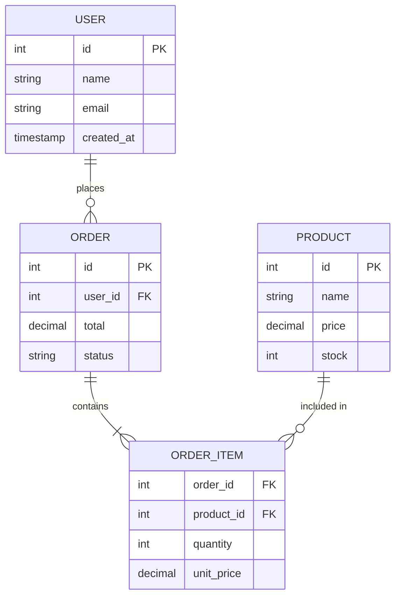

# Data Modeling
*Designing the structure of your database*

## What is Data Modeling
*Blueprint for how data is stored and related*

**Data Model** – Structure that defines how data is organized, stored, and related  
**Entity** – A real-world object with data (User, Product, Order)  
**Attribute** – Property of an entity (name, email, price)  
**Relationship** – How entities are connected

---

## Entity-Relationship (ER) Diagram

```
[User] ──(has)──< [Order] >──(contains)──< [Product]
         1:N                    N:M
```

### Cardinality Types

| Type | Meaning | Example |
|---|---|---|
| 1:1 | One-to-one | User ↔ Profile |
| 1:N | One-to-many | User → Orders |
| N:M | Many-to-many | Orders ↔ Products |

---

## Relationships in SQL

### One-to-One (1:1)

```sql
CREATE TABLE users (
    id      SERIAL PRIMARY KEY,
    email   VARCHAR(255)
);

CREATE TABLE profiles (
    id         SERIAL PRIMARY KEY,
    user_id    INT UNIQUE REFERENCES users(id),  -- UNIQUE enforces 1:1
    bio        TEXT,
    avatar_url VARCHAR(255)
);
```

### One-to-Many (1:N)

```sql
CREATE TABLE users (
    id    SERIAL PRIMARY KEY,
    name  VARCHAR(100)
);

CREATE TABLE orders (
    id      SERIAL PRIMARY KEY,
    user_id INT REFERENCES users(id),   -- many orders per user
    total   DECIMAL(10, 2)
);
```

### Many-to-Many (N:M)
*Requires a junction/pivot table*

```sql
CREATE TABLE orders (
    id SERIAL PRIMARY KEY
);

CREATE TABLE products (
    id    SERIAL PRIMARY KEY,
    name  VARCHAR(100),
    price DECIMAL(10, 2)
);

-- Junction table
CREATE TABLE order_items (
    order_id   INT REFERENCES orders(id),
    product_id INT REFERENCES products(id),
    quantity   INT DEFAULT 1,
    unit_price DECIMAL(10, 2),
    PRIMARY KEY (order_id, product_id)
);
```

---

## Mermaid ER Diagram



---

## Normalization vs Denormalization

### Normalization
*Remove redundancy — split data into separate tables*

**Pros**: No data duplication, easier updates, less storage  
**Cons**: More JOINs needed, slower reads for complex queries

```sql
-- Normalized: country is in separate table
CREATE TABLE countries (id SERIAL PRIMARY KEY, name VARCHAR(100));
CREATE TABLE users (id SERIAL PRIMARY KEY, country_id INT REFERENCES countries(id));
```

### Denormalization
*Add redundancy for read performance — store computed or duplicate data*

**Pros**: Faster reads, fewer JOINs  
**Cons**: Data can go out of sync, more complex writes

```sql
-- Denormalized: store country name directly in users
CREATE TABLE users (
    id           SERIAL PRIMARY KEY,
    country_name VARCHAR(100)   -- duplicated, but faster reads
);

-- Pre-computed aggregate
CREATE TABLE users (
    id          SERIAL PRIMARY KEY,
    order_count INT DEFAULT 0   -- updated when orders change
);
```

**When to denormalize**: Read-heavy workloads, analytics/reporting, when JOINs become a bottleneck

---

## Schema Design Patterns

### Polymorphic Association
*One table links to multiple other tables*

```sql
-- Comment can belong to Post or Video
CREATE TABLE comments (
    id            SERIAL PRIMARY KEY,
    commentable_id   INT,
    commentable_type VARCHAR(50),  -- 'post' or 'video'
    body          TEXT
);
```

**Tradeoff**: No foreign key enforcement. Prefer explicit tables when possible.

### Status/State Columns

```sql
-- Use VARCHAR with CHECK constraint or separate table
CREATE TABLE orders (
    id     SERIAL PRIMARY KEY,
    status VARCHAR(20) CHECK (status IN ('pending', 'paid', 'shipped', 'cancelled'))
);
```

### Hierarchical Data (Adjacency List)

```sql
-- Categories with parent/child
CREATE TABLE categories (
    id        SERIAL PRIMARY KEY,
    name      VARCHAR(100),
    parent_id INT REFERENCES categories(id)  -- NULL = root
);

-- Query all descendants (PostgreSQL recursive CTE)
WITH RECURSIVE category_tree AS (
    SELECT id, name, parent_id FROM categories WHERE id = 1  -- start node
    UNION ALL
    SELECT c.id, c.name, c.parent_id
    FROM categories c
    JOIN category_tree ct ON c.parent_id = ct.id
)
SELECT * FROM category_tree;
```

---

## Naming Conventions

```
Tables:       plural, snake_case         → users, order_items
Columns:      singular, snake_case       → user_id, created_at
Primary keys: id                         → id
Foreign keys: <table_singular>_id        → user_id, product_id
Indexes:      idx_<table>_<column>       → idx_users_email
Constraints:  <table>_<column>_<type>   → users_email_unique
```

---

## Design Checklist

```
✓ Every table has a primary key
✓ Foreign keys reference PKs in other tables
✓ Use appropriate data types (DECIMAL for money, TIMESTAMPTZ for dates)
✓ Add NOT NULL where values are always required
✓ Consider indexes on frequently queried columns
✓ Use created_at / updated_at on all tables
✓ Normalize first, then denormalize where needed for performance
✓ Draw an ER diagram before writing DDL
```
