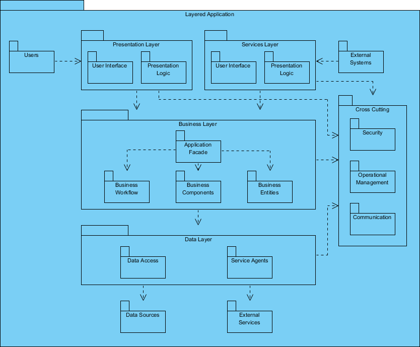

# UML Diagrams Overview

UML (Unified Modeling Language) defines 14 diagram types, split into **structural** (static) and **behavioral** (dynamic).

## Most Important

The five most used in practice:

1. Class
2. Use Case
3. Sequence
4. Activity
5. State Machine

## Structural Diagrams

### Class Diagram

- Importance: High
- Usage: Core of object-oriented design. Defines classes, attributes, methods, and relationships.
- References:
  - [Visual Paradigm – Class Diagram](https://www.visual-paradigm.com/guide/uml-unified-modeling-language/what-is-class-diagram/)
  - [GeeksforGeeks – UML Class Diagrams](https://www.geeksforgeeks.org/unified-modeling-language-uml-class-diagrams/)

### Component Diagram

- Importance: Medium
- Usage: Shows software components and their dependencies.
- References:
  - [Visual Paradigm – Component Diagram](https://www.visual-paradigm.com/guide/uml-unified-modeling-language/what-is-component-diagram/)
  - [Lucidchart – UML Component Diagram](https://www.lucidchart.com/pages/uml-component-diagram)

### Deployment Diagram

- Importance: Medium
- Usage: Describes physical deployment of artifacts across nodes.
- References:
  - [Visual Paradigm – Deployment Diagram](https://www.visual-paradigm.com/guide/uml-unified-modeling-language/what-is-deployment-diagram/)
  - [Lucidchart – UML Deployment Diagram](https://www.lucidchart.com/pages/uml-deployment-diagram)

### Package Diagram

- Importance: Medium
- Usage: Groups model elements into modules and shows their dependencies.
- References:
  - [Visual Paradigm – Package Diagram](https://www.visual-paradigm.com/guide/uml-unified-modeling-language/what-is-package-diagram/)
  - [Lucidchart – UML Package Diagram](https://www.lucidchart.com/pages/uml-package-diagram)

### Object Diagram

- Importance: Low
- Usage: Snapshot of class instances with concrete values at a given time.
- References:
  - [Visual Paradigm – Object Diagram](https://www.visual-paradigm.com/guide/uml-unified-modeling-language/what-is-object-diagram/)
  - [GeeksforGeeks – Object Diagrams](https://www.geeksforgeeks.org/unified-modeling-language-uml-object-diagrams/)

### Composite Structure Diagram

- Importance: Low
- Usage: Shows the internal structure of a class and its collaborations.
- References:
  - [Visual Paradigm – Composite Structure Diagram](https://www.visual-paradigm.com/guide/uml-unified-modeling-language/what-is-composite-structure-diagram/)
  - [UML-Diagrams.org – Composite Structure Diagrams](https://www.uml-diagrams.org/composite-structure-diagrams.html)

### Profile Diagram

- Importance: Low
- Usage: Extends UML for specific domains via stereotypes and tagged values.
- References:
  - [Visual Paradigm – Profile Diagram](https://www.visual-paradigm.com/guide/uml-unified-modeling-language/what-is-profile-diagram/)
  - [UML-Diagrams.org – Profile Diagrams](https://www.uml-diagrams.org/profile-diagrams.html)

## Behavioral Diagrams

### Use Case Diagram

- Importance: High
- Usage: Captures functional requirements from the user perspective.
- References:
  - [Visual Paradigm – Use Case Diagram](https://www.visual-paradigm.com/guide/uml-unified-modeling-language/what-is-use-case-diagram/)
  - [GeeksforGeeks – Use Case Diagrams](https://www.geeksforgeeks.org/use-case-diagram/)

### Sequence Diagram

- Importance: High
- Usage: Describes message exchange between objects over time.
- References:
  - [Visual Paradigm – Sequence Diagram](https://www.visual-paradigm.com/guide/uml-unified-modeling-language/what-is-sequence-diagram/)
  - [GeeksforGeeks – Sequence Diagrams](https://www.geeksforgeeks.org/unified-modeling-language-uml-sequence-diagrams/)

### Activity Diagram

- Importance: High
- Usage: Models workflows, business processes, and control flow.
- References:
  - [Visual Paradigm – Activity Diagram](https://www.visual-paradigm.com/guide/uml-unified-modeling-language/what-is-activity-diagram/)
  - [Lucidchart – UML Activity Diagram](https://www.lucidchart.com/pages/uml-activity-diagram)

### State Machine Diagram

- Importance: High
- Usage: Represents the lifecycle of an object through states and transitions.
- References:
  - [Visual Paradigm – State Machine Diagram](https://www.visual-paradigm.com/guide/uml-unified-modeling-language/what-is-state-machine-diagram/)
  - [Lucidchart – UML State Machine Diagram](https://www.lucidchart.com/pages/uml-state-machine-diagram)

### Communication Diagram

- Importance: Low
- Usage: Alternative to sequence diagrams, emphasizing object links.
- References:
  - [Visual Paradigm – Communication Diagram](https://www.visual-paradigm.com/guide/uml-unified-modeling-language/what-is-communication-diagram/)
  - [UML-Diagrams.org – Communication Diagrams](https://www.uml-diagrams.org/communication-diagrams.html)

### Timing Diagram

- Importance: Low
- Usage: Shows state changes of objects against a time axis.
- References:
  - [Visual Paradigm – Timing Diagram](https://www.visual-paradigm.com/guide/uml-unified-modeling-language/what-is-timing-diagram/)
  - [UML-Diagrams.org – Timing Diagrams](https://www.uml-diagrams.org/timing-diagrams.html)

### Interaction Overview Diagram

- Importance: Low
- Usage: High-level combination of activity and sequence diagrams.
- References:
  - [Visual Paradigm – Interaction Overview Diagram](https://www.visual-paradigm.com/guide/uml-unified-modeling-language/what-is-interaction-overview-diagram/)
  - [UML-Diagrams.org – Interaction Overview Diagrams](https://www.uml-diagrams.org/interaction-overview-diagrams.html)

